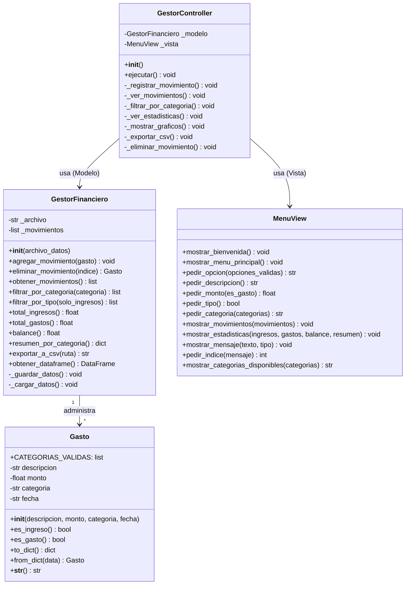

```mermaid
classDiagram
    class Gasto {
        +CATEGORIAS_VALIDAS: list
        -str descripcion
        -float monto
        -str categoria
        -str fecha
        +__init__(descripcion, monto, categoria, fecha)
        +es_ingreso() bool
        +es_gasto() bool
        +to_dict() dict
        +from_dict(data) Gasto
        +__str__() str
    }

    class GestorFinanciero {
        -str _archivo
        -list _movimientos
        +__init__(archivo_datos)
        +agregar_movimiento(gasto) void
        +eliminar_movimiento(indice) Gasto
        +obtener_movimientos() list
        +filtrar_por_categoria(categoria) list
        +filtrar_por_tipo(solo_ingresos) list
        +total_ingresos() float
        +total_gastos() float
        +balance() float
        +resumen_por_categoria() dict
        +exportar_a_csv(ruta) str
        +obtener_dataframe() DataFrame
        -_guardar_datos() void
        -_cargar_datos() void
    }

    class MenuView {
        +mostrar_bienvenida() void
        +mostrar_menu_principal() void
        +pedir_opcion(opciones_validas) str
        +pedir_descripcion() str
        +pedir_monto(es_gasto) float
        +pedir_tipo() bool
        +pedir_categoria(categorias) str
        +mostrar_movimientos(movimientos) void
        +mostrar_estadisticas(ingresos, gastos, balance, resumen) void
        +mostrar_mensaje(texto, tipo) void
        +pedir_indice(mensaje) int
        +mostrar_categorias_disponibles(categorias) str
    }

    class GestorController {
        -GestorFinanciero _modelo
        -MenuView _vista
        +__init__()
        +ejecutar() void
        -_registrar_movimiento() void
        -_ver_movimientos() void
        -_filtrar_por_categoria() void
        -_ver_estadisticas() void
        -_mostrar_graficos() void
        -_exportar_csv() void
        -_eliminar_movimiento() void
    }

    GestorFinanciero "1" --> "*" Gasto : administra
    GestorController --> GestorFinanciero : usa (Modelo)
    GestorController --> MenuView : usa (Vista)
```
